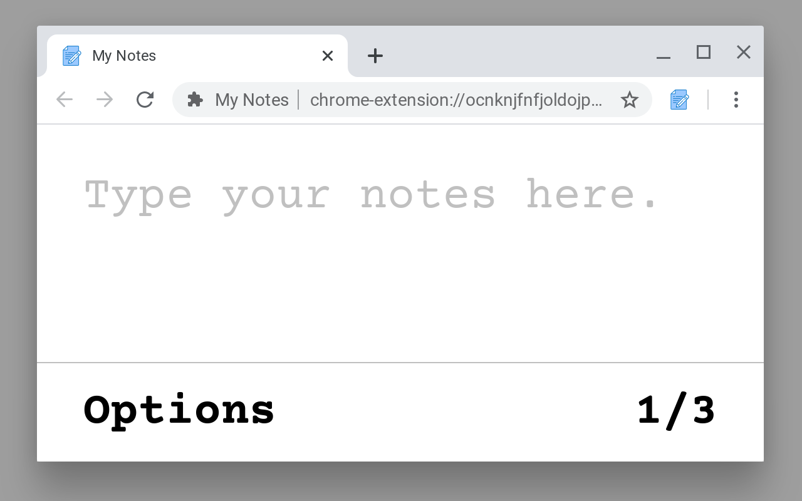
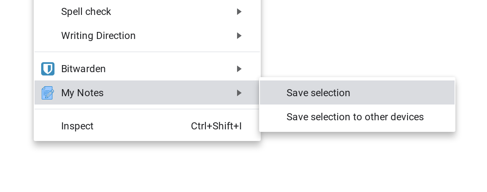

# My Notes

**Chrome Extension** that turns your **"New Tab"** into **a note taking tool.**

- Great for Notes, Todos, and sharing text (Copy/Paste)

- It works immediately after you open a **"New Tab"**

- Every edit and paste is saved (and waiting for you once you come back)

- And! It is Synchronized across every Chrome window you have open

 

## Image

 

## Context Menu

After selecting a text on any website, you can use the context menu
to save the note.

 

There are 2 options available, one saves the note to your machine,
the second option saves the note to Chrome Sync,
so it can be picked up from any other machine of yours
(requirement: logged into Google Account).

 

## Install

To install My Notes, open:

https://chrome.google.com/webstore/detail/my-notes/lkeeogfaiembcblonahillacpaabmiop

To install My Notes manually, follow these instructions:

1. Click on **"Clone or download"** and then **"Download ZIP"**
2. Extract the downloaded **ZIP**
3. In Chrome, go to **Extensions** from the menu or visit [chrome://extensions](chrome://extensions) from a new tab
4. In Chrome Extensions, click the **"Load unpacked"** button
5. Navigate to the plugin folder (from the second step) and click the **"Open"** button
