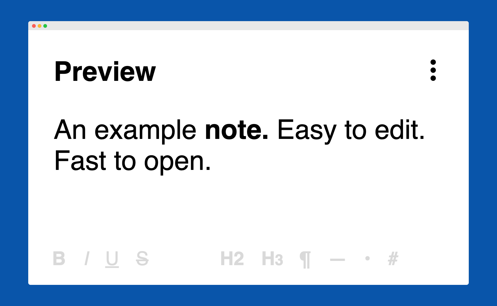
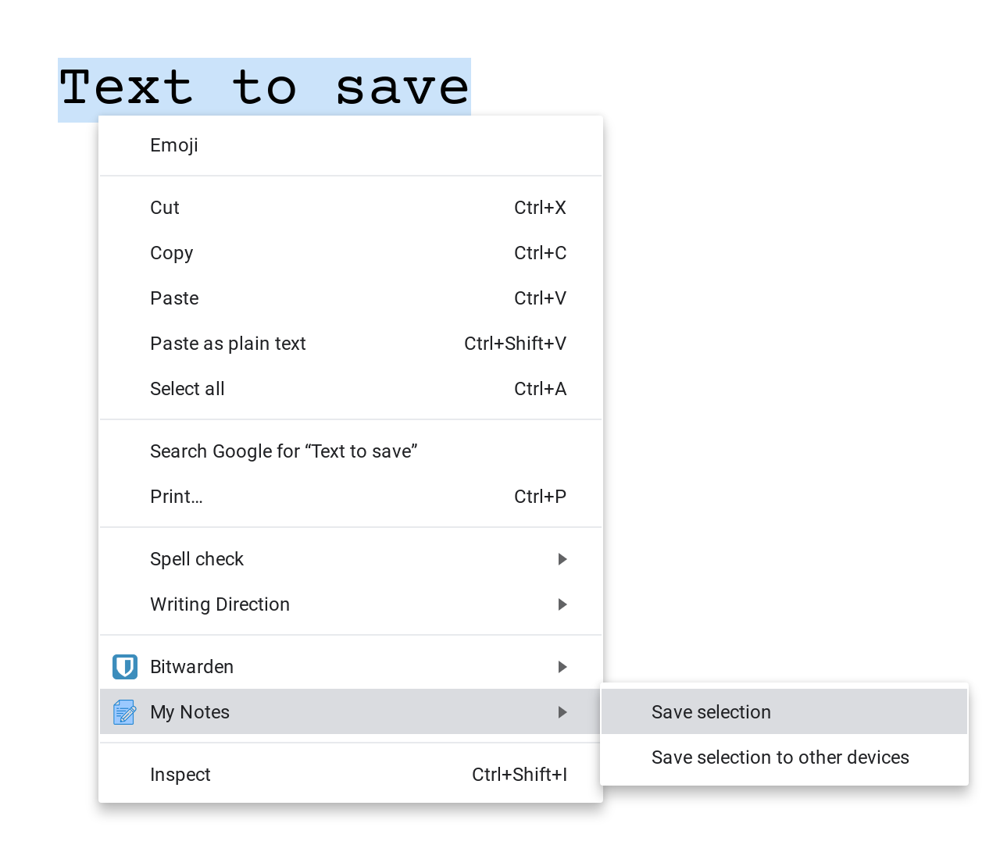

**My Notes** is a note-taking app directly in Chrome.
Available on [Web Store](https://chrome.google.com/webstore/detail/my-notes/lkeeogfaiembcblonahillacpaabmiop).

## Features

- Quickly accessible (see [How to open](#how-to-open))

- Saved automatically

- Updated in every open window

- HTML (bold, italic, underline, etc.)

- Transfer text to another computer (see [Context menu](#context-menu))

- Google Drive Sync, to backup, share, and sync the notes between computers (see [Google Drive Sync](#google-drive-sync))

- Themes (Light, Dark, Custom)

- Hotkeys

- Works offline

<br>

## How to open

**My Notes:**

- Click on My Notes icon in Chrome toolbar
- In every new tab (see Options)
- Hotkey (see Options)

**Options:**

- Click on the gear icon
- Right-click on My Notes icon in Chrome toolbar and select Options
- Hotkey (see Options)

<br>

## Options

- Font type (Serif, Sans Serif, Monospace, Google Fonts)
- Font size
- Theme (Light, Dark, Custom)
- Hotkeys
- Open My Notes in every New Tab
- Enable Google Drive Sync
- Indent text on Tab

<br>

## Context menu

Allows you to quickly save the selected text to My Notes Clipboard (a special note in My Notes).



**Save selection** — Saves the selected text to My Notes Clipboard in your current computer.

**Save selection to other devices** — Saves the selected text to My Notes Clipboard in your other computer(s).
**Condition:** My Notes needs to be open, same Google Account needs to be used.

<br>

## Google Drive Sync

**Google Drive Sync** automatically syncs your notes between My Notes and your Google Drive, in both directions (from Google Drive, to Google Drive).

This gives you:

- a backup (notes can be restored in the future)
- can modify the notes in Google Drive, My Notes, and vice versa
- can modify the notes from other computers (by installing My Notes and using the same Google Account)

### Location

Notes are uploaded to your Google Drive to the folder **My Notes**. This folder is created automatically.
If the folder exists from a previous installation, it is restored, notes are downloaded and uploaded, and the synchronization continues.

### Synchronization

Notes are synchronized immediately after you enable **Google Drive Sync**.
Then on every My Notes **Open/Close/Refresh**, or with the **"Sync Now"** button.
Synchronization works in both ways — to Google Drive, from Google Drive.

### Access

My Notes can only access the files it created.
It cannot see the other files in your Google Drive.

<br>

## Folder structure

```
background/
  google-drive/   # Everything related to Google Drive Sync
                    # - File operations (List, Create, Get, Update, Delete)
                    # - Synchronization (to Google Drive, from Google Drive)
                    # - Queries (find My Notes folder, list files in My Notes folder)
                    # - Multipart bodies (create My Notes folder, create file, update file)
                    # - Tests

  init/           # Run when My Notes is installed/updated
                    # - Sets a Unique ID for My Notes installation (used by Context menu), if not already set
                    # - Migrates notes and options
                    # - Creates Context menu and attaches the events
                    # - Creates a Notification when My Notes is installed/updated
                    # - Registers the ways to open My Notes (icon click, in every New Tab)
                    # - Registers events to trigger Google Drive Sync from My Notes

images/           # Images and icons used in My Notes or README

themes/           # Light, Dark, Custom

notes/            # Everything related to Notes
                    # - Create/Rename/Delete notes; Note editing, Note saving
                    # - Toolbar
                    # - Every UI init and update when data changes
                    # - Registers commands (Toggle Focus mode - can be enabled in Options)

options/          # Everything related to Options
                    # - Font type, Font size, Theme, etc.
                    # - Every UI init and update when data changes

shared/           # Everything common (used at more places)
                    # - Date formatting (Last sync)
                    # - Managing the permissions (Requesting, Removing, Checking)
                    # - Helpers for Chrome Storage
                    # - Default values (Notes, Options)

tests/            # Entrypoint for tests
                    # - Runs every __tests__/index.html in the project
                    # - Prints "net::ERR_FILE_NOT_FOUND" if the test file is not found
                    # - Prints "Assertion failed: console.assert" if any assertion failed


.eslintrc         # To enforce code quality and same coding style
.gitignore        # To exclude any generated files (only .DS_Store at this point)

LICENSE           # MIT
manifest.json     # Main extension file


background.html   # Entrypoint for background script
background.js

notes.html        # Entrypoint for notes
notes.css
notes.js

options.html      # Entrypoint for options
options.css
options.js


README.md
```

<br>

## Permissions

**Required:**

- `"storage"` — used to save the notes and options to Chrome Storage
- `"contextMenus"` — used to create My Notes Context menu

**Optional:**

- `"tabs"` — used by **Open My Notes in every New Tab** (see **Options**)
- `"identity"` — used by **Enable Google Drive Sync** (see **Options**)

`"tabs"` is a more powerful permission — the displayed warning may contain an unrelated message — `It can: Read your Browsing history`.
